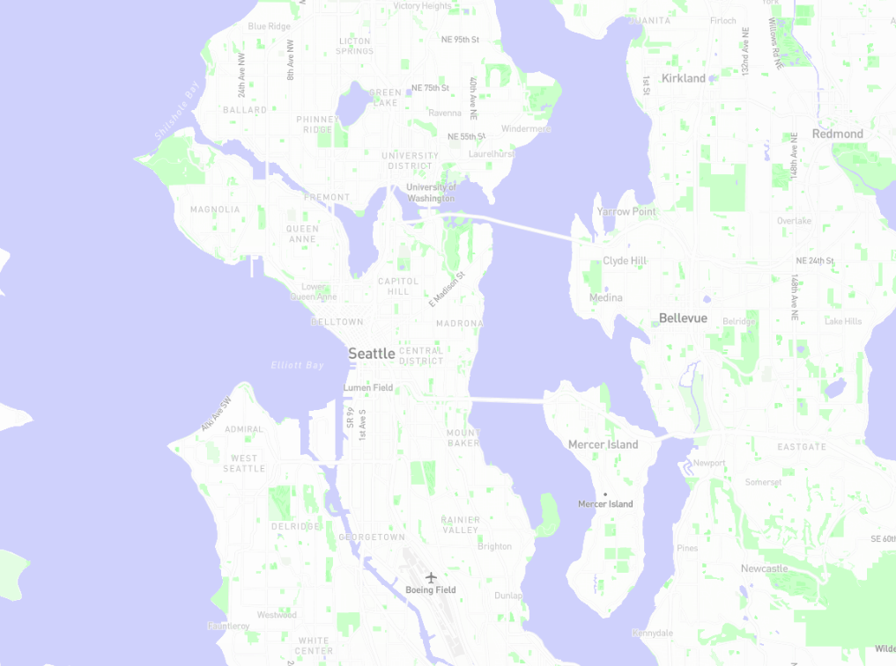
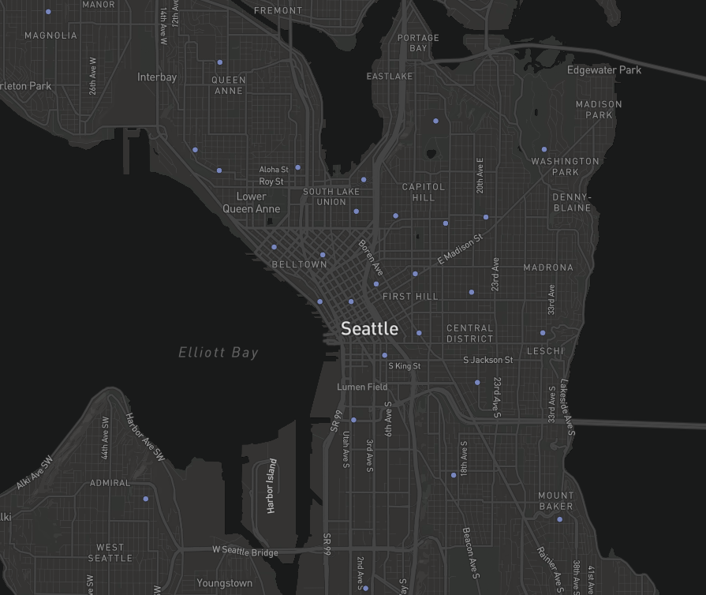
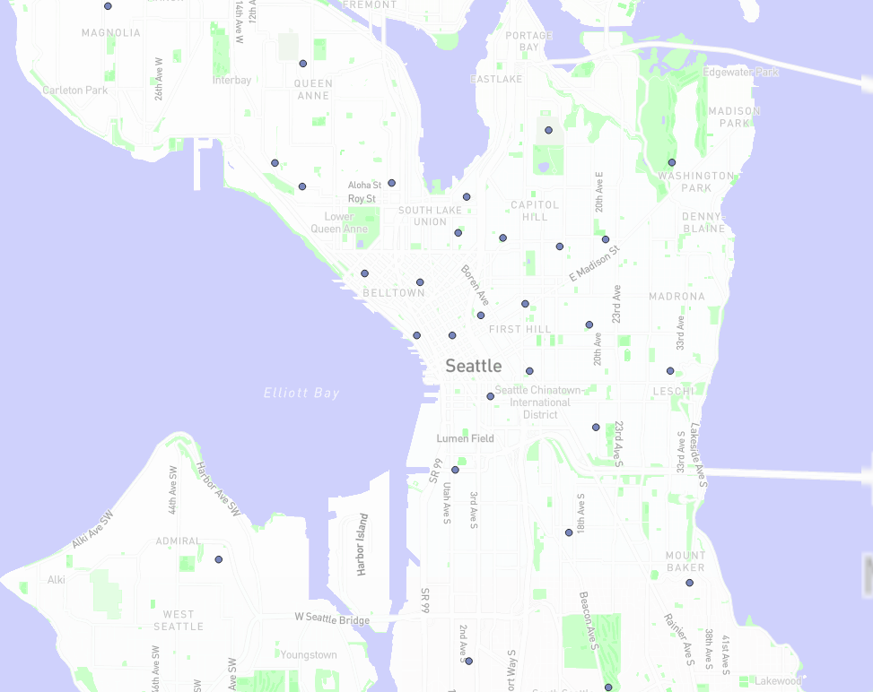
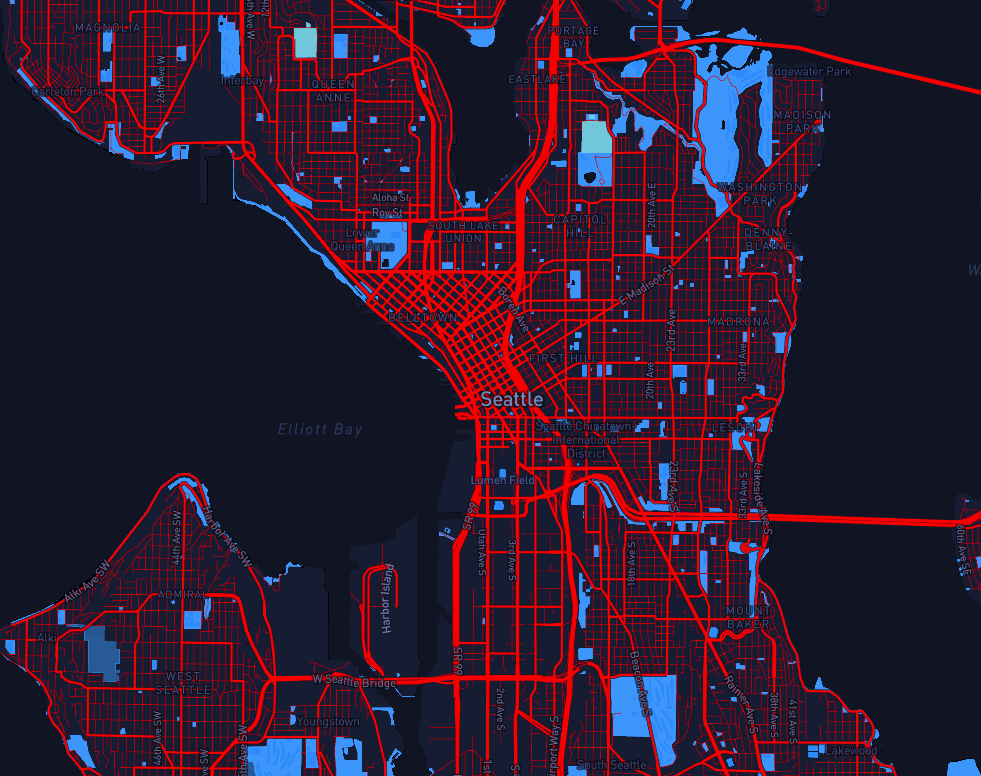

# Lab 4

For this lab, we're looking at Seattle. This is because I have some familiarity with publically available data for this city. 

Zoom levels are set to a minimum of 0 and a maximum of 16 for each tileset.

The first tileset simply changes to a light basemap with green greenspaces and blue water. The second shows the centers of SPD precincts. The third shows both the light basemap and the centers of SPD precincts. finally, the fourth tileset is a basemap with police-themed colors. 